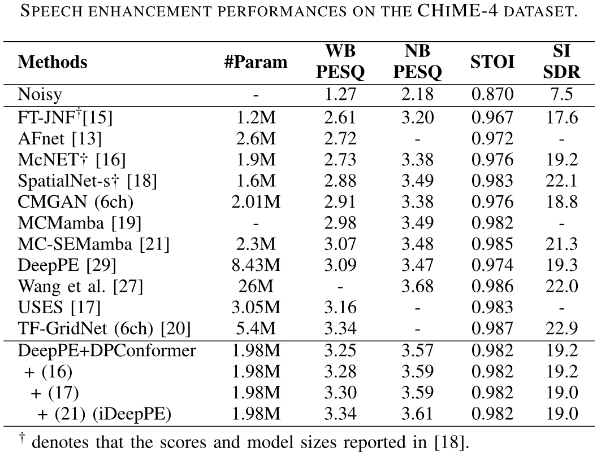
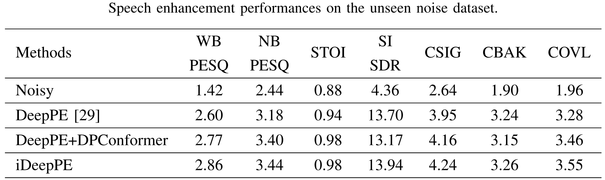

# iDeepPE

The official repo of:
S. Cheong, M. Kim, and J. W. Shin, "Integrated DNN-based Parameter Estimation for Multichannel Speech Enhancement", submitted in IEEE Signal Processing Letters 2025.

## Performance
 
- Main experiments on CHiME-4 dataset
  <br>

- Experiments on the additional evaluation dataset with unseen noises 
  <br>
  
  To demonstrate the performance of the proposed iDeepPE under the presence of unseen noises, we have conducted an additional experiment on the clean speech in the CHiME-4 simulated dataset mixed with different types of noises comparing DeepPE, DeepPE+DPConformer, and iDeepPE. 
  The environmental noise in each file included a diffuse noise and one directional noise.
  Details of the unseen noise experiment are as follows:
  - Diffuse noise: generated from one of the 4 types of noises (kitchen, meeting room, office, and park) in the DEMAND dataset [R1] using the arbitrary noise field generator [R2]
  - Directional noise: competing speech selected from the VCTK corpus [R3] convolved with the room impulse responses generated by pyroomacoustics [R4]
    - Simulated room configuration
      - Room size [W, L, H]: randomly sampled from [2.5m, 3m, 2.2m]-[5m, 9m, 3.5m] 
      - RT60: randomly sampled from 0.3-0.5s 
      - Mic. position: random position in the xy plane but at least 1m away from the walls and at fixed height of 1.5m 
      - Directional noise source: located at a random position for each utterance which was at least 1 m away from the center of the tablet device and at least 30˚ away from the direction of the target speaker

  - Overall SNR range: approximately 1-7dB
    - SNRs for diffuse noises: 3, 6, 9 dB
    - SNRs for directional noises: 6, 9, 12 dB
  - Total generated samples: 2,340

## Installation
- Create a new virtual environment with Python >= 3.9 
- Install the package via ```pip install -r requirements.txt```
## Training & Evaluation
See ```how to train & test.txt```.
## Citations / References
[R1] J. Thiemann, N. Ito, and E. Vincent, ["The diverse environments multi-channel acoustic noise database (DEMAND): A database of multichannel environmental noise recordings,”](https://inria.hal.science/hal-00796707v1/document) in Proceedings of Meetings on Acoustics, vol. 19, no. 1, 2013.

[R2] E.A.P. Habets, I. Cohen, and S. Gannot, ["Generating nonstationary multisensor signals under a spatial coherence constraint,"](https://israelcohen.com/wp-content/uploads/2018/05/JASA_Nov2008.pdf) J. Acoust. Soc. Am. 2008, 124, 2911–2917.

[R3] C. Veaux, J. Yamagishi, and S. King, ["The Voice Bank corpus: Design, collection and data analysis of a large regional accent speech database,”](https://ieeexplore.ieee.org/document/6709856) in Proc. O-COCOSDA/CASLRE, 2013, pp. 1–4.

[R4] R. Scheibler, E. Bezzam, and I. Dokmani{\'c}, ["Pyroomacoustics: A python package for audio room simulation and array processing algorithms,”](https://ieeexplore.ieee.org/document/8461310) in Proc. IEEE Int. Conf. Acoust., Speech, Signal Process., 2018, pp. 351–355.